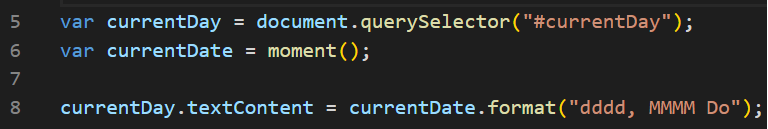
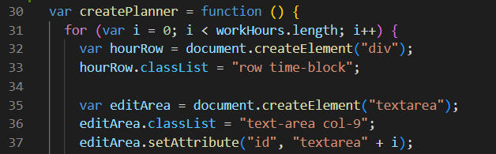
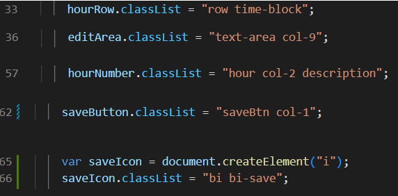
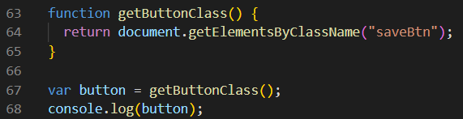
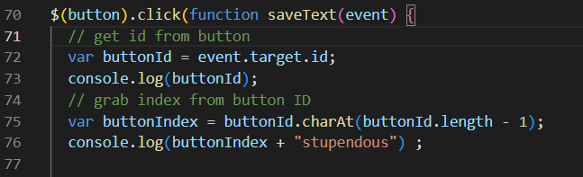
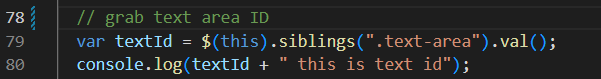
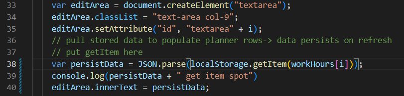
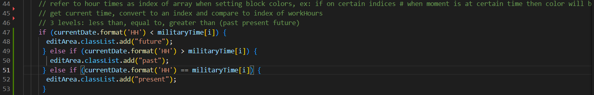

# Work-Day-Swagonizer

## General Info
The challenge this week was to create a daily planner that would enable the user to add and edit inputs into a text area corresponding to different times of the work day and allow those inputs to be saved and persist upon a browser refresh. There needed to be a display of the current date at the top as well as a color coded system linked to the different hourly time slots to signal to the user if a time or activity was planned for the past, present, or future.

## Adding the Current Date
To add the current date to the top of the page, I used moment() to get the current date data. I linked the moment data to the currentDay id to get the date onto the page and I formatted it dddd, MMMM Do to show the date as day of the week, month, and the ordinal number of the date. 

## Creating the Planner
My first step towards creating the planner was to create an array of all the hours to be used in the planner (9AM to 5PM)called workHours. After this was set I created a function to iterate from 0 to less than workHours.length and create new divs on each iteration. Also created on each iterations were: a p element to house the hour in the day, a text area that the user could edit, and a button for the user to save their inputs. 

As each new element was created I also added classes and an ID to style the elements according to the given CSS. A save icon was added to the save button elements by creating a new variable to create the element 'i' and then adding the appropriate bootstrap styling.

## Making the Planner Functional
To make the planner functional in displaying past, present, and future events I needed to 

### Saving Daily Tasks To Local Storage
To save the users text inputs, I had to first return the buttons created through the createPlanner function. I did this by grabbing all of the elements with the class of 'saveBtn' because each of my created buttons would have this class while still having a different id. I set this to var button so that when I set an on click event it would apply to all of my created save buttons. 

To save the user inputs into local storage I got the id of the button pressed using event.target.id. After finding the button's id I found the button's index by getting the last character of the id using .charAt(buttonId.length - 1). I was able to do this because when the hour-row elements were created, the index was appended to the end as each was iterated.

After getting the button's index I grabbed the text area next to the clicked button using the jquery method of $(this).siblings.

With the button's index and the text area connected to the same button, I stored them to local storage by setting the key value to be the value of workHours at the button's index (this will set the key to one of the hour rows created for the user to edit) and then using JSON.stringify to turn the textId (text area content) into a string to be parsed later on. 

### Getting User Inputs From Local Storage

To allow the user's data to persist, my next step was to pull the value from the local storage at the key index of workHours[i] and then add it to the innerText of the editable text areas being created. This way, when the page is refreshed, the values will repopulate the divs as they are created and the user will continue to see their text inputs.

## How to Color-Code to Indicate Time
To color code the rows I set up an array with the work hours set in military time. Since the military time array has the same number of values as workHours, I could compare the hour value of moment.js with the same index. I set up a conditional where the hour value of moment.js was compared to the index of the military time array and when certain conditions were met, the proper css classes were added to the editArea. The css contains the color coding we want so all I needed to do was add the correct class for the appropriate condition.

## Links

Github Repository Link: https://github.com/hvphan1993/Work-Day-Swagonizer.git

Active Link: https://hvphan1993.github.io/Work-Day-Swagonizer/